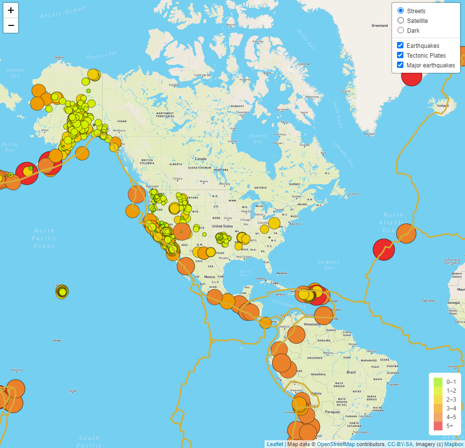

# Mapping Earthquakes

## Challenge Overview
You are to visualize earthquake data in relation to tectonic plates' location on the earth. You are to create togglable overlays for all earthquake data, major earthquakes, and the tectonic plates. You also want to display this data on a new map style.

## Resources
- [All Earthquakes in the past 7 days](https://earthquake.usgs.gov/earthquakes/feed/v1.0/summary/all_week.geojson)
- [All M4.5+ Earthquakes in the past 7 days](https://earthquake.usgs.gov/earthquakes/feed/v1.0/summary/4.5_week.geojson)
- Software: Visual Studio Code 1.47.2

## Challenge Results
Here is a screenshot of the finished map with the layers control and legend:
